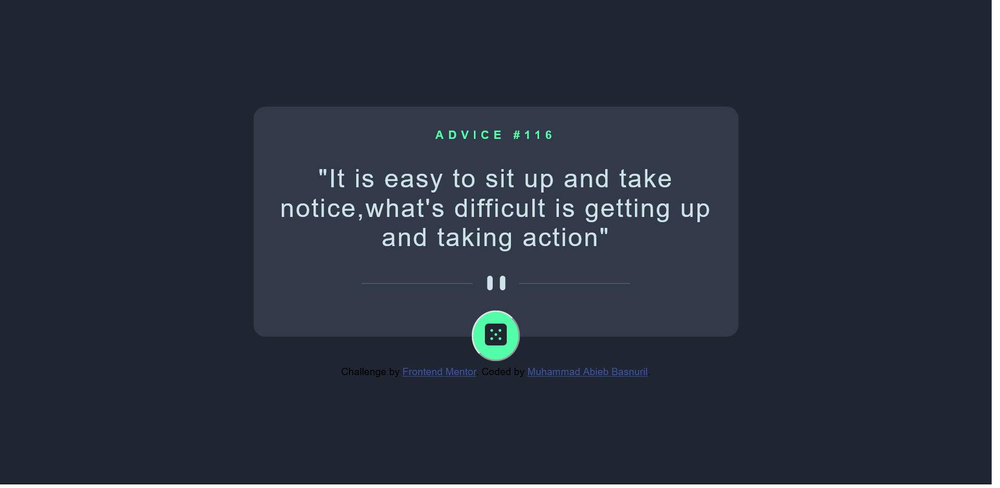
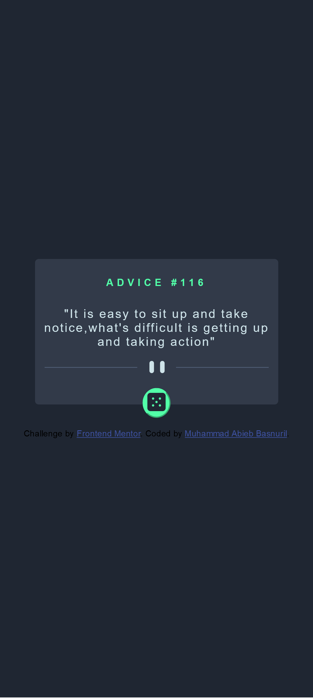

# Frontend Mentor - Advice generator app solution

This is a solution to the [Advice generator app challenge on Frontend Mentor](https://www.frontendmentor.io/challenges/advice-generator-app-QdUG-13db). Frontend Mentor challenges help you improve your coding skills by building realistic projects.

## Table of contents

- [Overview](#overview)
  - [The challenge](#the-challenge)
  - [Screenshot](#screenshot)
  - [Links](#links)
- [My process](#my-process)
  - [Built with](#built-with)
  - [What I learned](#what-i-learned)
  - [Continued development](#continued-development)
  - [Useful resources](#useful-resources)
- [Author](#author)

## Overview

### The challenge

Users should be able to:

- View the optimal layout for the app depending on their device's screen size
- Media Query
- Learn about calling an API

### Screenshot

### Links

- Solution URL: [Add solution URL here](https://your-solution-url.com)
- Live Site URL: [Add live site URL here](https://your-live-site-url.com)

## My process

### Built with

- Semantic HTML5 markup
- CSS custom properties
- Flexbox
- JavaScript
- Fetch API

### What I learned

I learn a lot about API and JavaScript,but there is so much improvement i have to do to make it better to read and to use

### Continued development

With this project,i hope i can overcome any project that require JavaScript and Fetch API to solve,this is just first step so i know that there is many i want to fix,but im glad that i can finish this challenge

**Note: Delete this note and the content within this section and replace with your own plans for continued development.**

### Useful resources

- [https://medium.com/m/global-identity?redirectUrl=https%3A%2F%2Flevelup.gitconnected.com%2Fall-possible-ways-of-making-an-api-call-in-plain-javascript-c0dee3c11b8b] This helped me for understanding how to make API calls in some ways
- [https://medium.com/cleverprogrammer/using-the-javascript-fetch-method-to-get-data-from-an-api-mini-project-10c0d602dae5] This article helped me to understanding about FETCH API

## Author

- Frontend Mentor - [@AbibGuardian50](https://www.frontendmentor.io/profile/AbibGuardian50)
